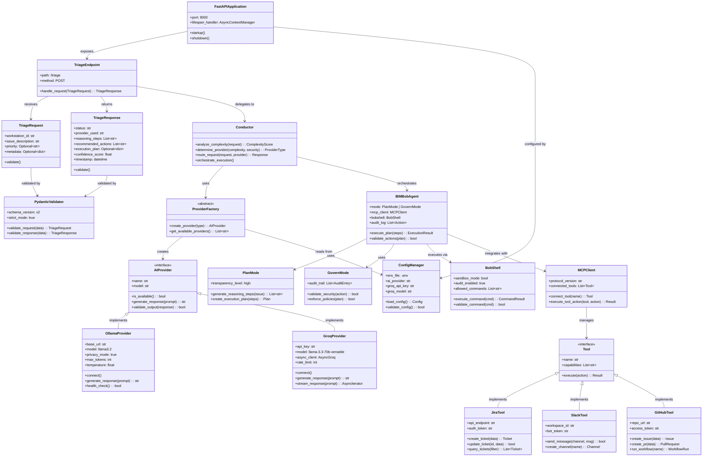
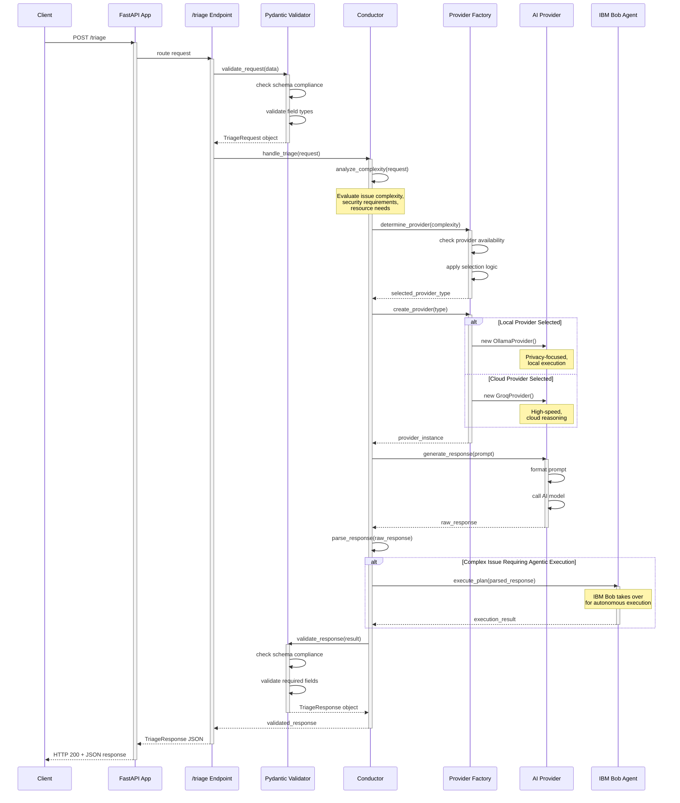
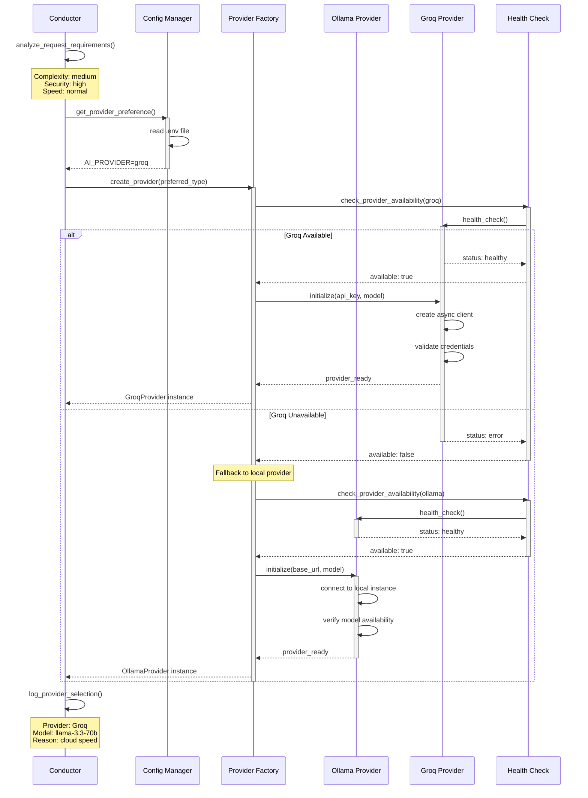

# Orchestra 8000 - Architecture Diagrams

This document contains detailed domain and sequence diagrams for the Orchestra 8000 Agentic SDLC Orchestrator.

---

## 1. Domain Diagram

The domain diagram shows the key entities, their attributes, relationships, and responsibilities within the Orchestra 8000 system.



---

## 2. Sequence Diagram: Triage Request Flow

This diagram shows the complete flow of a triage request through the Orchestra 8000 system, from initial HTTP request to final response.



---

## 3. Sequence Diagram: Provider Orchestration

This diagram details how the system dynamically selects and orchestrates between local Ollama and cloud Groq providers.



---

## 4. Sequence Diagram: IBM Bob Agentic Execution

This diagram shows how IBM Bob executes autonomous plans using Plan Mode, BobShell, and MCP tool integrations.

```mermaid
sequenceDiagram
    participant Conductor
    participant Bob as IBM Bob Agent
    participant Plan as Plan Mode
    participant Govern as Govern Mode
    participant Shell as BobShell
    participant MCP as MCP Client
    participant Jira as Jira Tool
    participant GitHub as GitHub Tool
    participant Audit as Audit Logger
    
    Conductor->>Bob: execute_plan(issue_context)
    activate Bob
    
    Bob->>Plan: generate_reasoning_steps(issue)
    activate Plan
    Plan->>Plan: analyze issue description
    Plan->>Plan: identify required actions
    Plan->>Plan: create step-by-step plan
    Plan-->>Bob: reasoning_steps[]
    deactivate Plan
    
    Note over Bob: Steps:<br/>1. Create Jira ticket<br/>2. Clone repository<br/>3. Run diagnostics<br/>4. Create GitHub issue
    
    loop For each step in plan
        Bob->>Govern: validate_action(step)
        activate Govern
        Govern->>Govern: check security policies
        Govern->>Govern: verify permissions
        Govern->>Govern: assess risk level
        
        alt Action Approved
            Govern-->>Bob: validation: approved
            deactivate Govern
            
            alt Step requires MCP tool
                Bob->>MCP: execute_tool_action(tool_name, action)
                activate MCP
                
                alt Jira Action
                    MCP->>Jira: create_ticket(data)
                    activate Jira
                    Jira->>Jira: authenticate
                    Jira->>Jira: validate ticket data
                    Jira->>Jira: create ticket in project
                    Jira-->>MCP: ticket_id: PROJ-123
                    deactivate Jira
                else GitHub Action
                    MCP->>GitHub: create_issue(data)
                    activate GitHub
                    GitHub->>GitHub: authenticate
                    GitHub->>GitHub: validate issue data
                    GitHub->>GitHub: create issue in repo
                    GitHub-->>MCP: issue_number: 456
                    deactivate GitHub
                end
                
                MCP-->>Bob: tool_result
                deactivate MCP
                
            else Step requires shell command
                Bob->>Shell: execute_command(cmd)
                activate Shell
                Shell->>Shell: validate_command(cmd)
                Shell->>Shell: check allowed_commands list
                Shell->>Shell: run in sandbox mode
                Shell->>Shell: capture output
                Shell-->>Bob: command_result
                deactivate Shell
            end
            
            Bob->>Audit: log_action(step, result)
            activate Audit
            Audit->>Audit: record timestamp
            Audit->>Audit: store action details
            Audit->>Audit: save result status
            Audit-->>Bob: logged
            deactivate Audit
            
        else Action Denied
            Govern-->>Bob: validation: denied, reason
            deactivate Govern
            Bob->>Audit: log_denied_action(step, reason)
            activate Audit
            Audit-->>Bob: logged
            deactivate Audit
            Note over Bob: Skip step,<br/>continue with plan
        end
    end
    
    Bob->>Bob: compile_execution_results()
    Bob->>Audit: finalize_audit_trail()
    activate Audit
    Audit-->>Bob: audit_complete
    deactivate Audit
    
    Bob-->>Conductor: ExecutionResult with audit trail
    deactivate Bob
```

---

## 5. Sequence Diagram: Pydantic Validation Flow

This diagram shows how Pydantic v2 ensures strict validation of all requests and responses.

```mermaid
sequenceDiagram
    participant Endpoint as /triage Endpoint
    participant Validator as Pydantic Validator
    participant Schema as Pydantic Schema
    participant Request as TriageRequest Model
    participant Response as TriageResponse Model
    
    Note over Endpoint: Incoming JSON data
    
    Endpoint->>Validator: validate_request(raw_json)
    activate Validator
    
    Validator->>Schema: load TriageRequest schema
    activate Schema
    Schema-->>Validator: schema definition
    deactivate Schema
    
    Validator->>Request: parse_obj(raw_json)
    activate Request
    
    Request->>Request: validate workstation_id: str
    Request->>Request: validate issue_description: str
    Request->>Request: validate priority: Optional[str]
    Request->>Request: validate metadata: Optional[dict]
    
    alt Validation Success
        Request->>Request: apply field validators
        Request->>Request: run model validators
        Request-->>Validator: TriageRequest instance
        deactivate Request
        Validator-->>Endpoint: validated_request
    else Validation Error
        Request-->>Validator: ValidationError
        deactivate Request
        Validator->>Validator: format error details
        Validator-->>Endpoint: HTTP 422 + error details
    end
    
    deactivate Validator
    
    Note over Endpoint: After processing...
    
    Endpoint->>Validator: validate_response(result_dict)
    activate Validator
    
    Validator->>Schema: load TriageResponse schema
    activate Schema
    Schema-->>Validator: schema definition
    deactivate Schema
    
    Validator->>Response: parse_obj(result_dict)
    activate Response
    
    Response->>Response: validate status: str
    Response->>Response: validate provider_used: str
    Response->>Response: validate reasoning_steps: List[str]
    Response->>Response: validate recommended_actions: List[str]
    Response->>Response: validate confidence_score: float
    Response->>Response: validate timestamp: datetime
    
    alt Validation Success
        Response->>Response: ensure strict JSON output
        Response->>Response: apply response validators
        Response-->>Validator: TriageResponse instance
        deactivate Response
        Validator-->>Endpoint: validated_response
    else Validation Error
        Response-->>Validator: ValidationError
        deactivate Response
        Validator->>Validator: log internal error
        Validator-->>Endpoint: HTTP 500 + error
    end
    
    deactivate Validator
```

---

## 6. Component Interaction Overview

```mermaid
graph TB
    subgraph Client Layer
        A[HTTP Client]
    end
    
    subgraph API Layer
        B[FastAPI Application]
        C[/triage Endpoint]
        D[Pydantic Validator]
    end
    
    subgraph Orchestration Layer
        E[Conductor]
        F[Provider Factory]
        G[Config Manager]
    end
    
    subgraph Provider Layer
        H[Ollama Provider<br/>Local Privacy]
        I[Groq Provider<br/>Cloud Speed]
    end
    
    subgraph Agentic Layer
        J[IBM Bob Agent]
        K[Plan Mode]
        L[Govern Mode]
        M[BobShell]
    end
    
    subgraph Integration Layer
        N[MCP Client]
        O[Jira Tool]
        P[Slack Tool]
        Q[GitHub Tool]
    end
    
    A -->|POST /triage| B
    B --> C
    C --> D
    D --> E
    E --> F
    F --> G
    F --> H
    F --> I
    E --> J
    J --> K
    J --> L
    J --> M
    J --> N
    N --> O
    N --> P
    N --> Q
    
    style A fill:#e1f5ff
    style B fill:#fff4e1
    style E fill:#ffe1f5
    style J fill:#e1ffe1
    style N fill:#f5e1ff
```

---

## Key Design Patterns

### 1. **Factory Pattern**
The `ProviderFactory` dynamically creates AI provider instances based on configuration and availability, enabling seamless switching between Ollama and Groq.

### 2. **Strategy Pattern**
Different AI providers implement the `AIProvider` interface, allowing the Conductor to work with any provider without knowing implementation details.

### 3. **Facade Pattern**
The `Conductor` acts as a facade, simplifying the complex orchestration of provider selection, request routing, and response validation.

### 4. **Observer Pattern**
The `Audit Logger` observes all actions performed by IBM Bob, creating a transparent audit trail for compliance and debugging.

### 5. **Adapter Pattern**
The `MCP Client` adapts various external tools (Jira, Slack, GitHub) to a unified interface for seamless integration.

---

## Data Flow Summary

1. **Request Ingress**: Client sends JSON to `/triage` endpoint
2. **Validation**: Pydantic validates request structure and types
3. **Orchestration**: Conductor analyzes complexity and selects provider
4. **Provider Execution**: Ollama or Groq generates AI response
5. **Agentic Processing**: IBM Bob executes multi-step plans if needed
6. **Tool Integration**: MCP connects to external systems (Jira, GitHub, Slack)
7. **Response Validation**: Pydantic ensures response schema compliance
8. **Response Delivery**: Validated JSON returned to client

---

## Security & Validation Layers

- **Input Validation**: Pydantic v2 strict mode on all requests
- **Command Validation**: BobShell whitelist for allowed commands
- **Action Governance**: Govern Mode validates all autonomous actions
- **Audit Trail**: Complete logging of all operations
- **Provider Isolation**: Local Ollama for sensitive data, Groq for speed

---

## Scalability Considerations

- **Async Architecture**: FastAPI with async/await for high concurrency
- **Provider Pooling**: Multiple provider instances for load distribution
- **Stateless Design**: Each request is independent for horizontal scaling
- **MCP Protocol**: Standardized tool integration for extensibility
- **Lifespan Management**: Proper resource cleanup on startup/shutdown