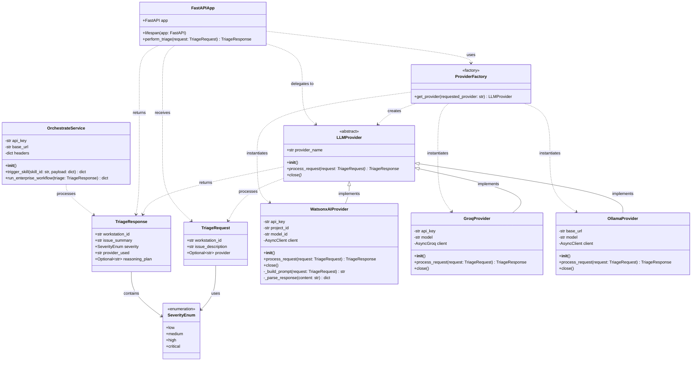

# Orchestra 8000 - Class Diagram

## Class Descriptions

### Core Models
- **SeverityEnum**: Enumeration defining issue severity levels (low, medium, high, critical)
- **TriageRequest**: Input model containing workstation ID, issue description, and optional provider selection
- **TriageResponse**: Output model with triage results including severity, summary, and reasoning

### Provider Architecture
- **LLMProvider**: Abstract base class defining the interface for all AI providers
- **WatsonxAIProvider**: IBM watsonx.ai implementation for enterprise-grade AI
- **GroqProvider**: Groq LPU implementation for ultra-fast inference
- **OllamaProvider**: Local Ollama implementation for privacy-focused deployments

### Factory Pattern
- **ProviderFactory**: Factory class that instantiates the appropriate provider based on configuration

### Application Layer
- **FastAPIApp**: Main application handling HTTP requests and orchestrating the triage process
- **OrchestrateService**: Service for triggering enterprise workflows based on triage results