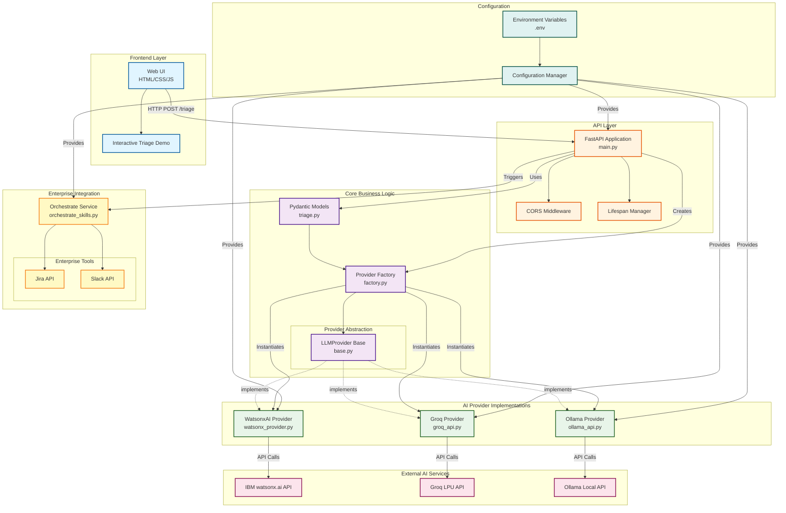

# Orchestra 8000 - Component Diagram

## Component Descriptions

### Frontend Layer
- **Web UI**: HTML/CSS/JavaScript interface for user interaction
- **Interactive Triage Demo**: Live demonstration of triage functionality with priority selection

### API Layer
- **FastAPI Application**: Main REST API server handling HTTP requests
- **CORS Middleware**: Cross-Origin Resource Sharing configuration for frontend access
- **Lifespan Manager**: Application startup and shutdown lifecycle management

### Core Business Logic
- **Pydantic Models**: Data validation and serialization models (TriageRequest, TriageResponse, SeverityEnum)
- **Provider Factory**: Factory pattern implementation for dynamic provider instantiation
- **LLMProvider Base**: Abstract base class defining provider interface

### AI Provider Implementations
- **WatsonxAI Provider**: IBM watsonx.ai integration for enterprise-grade AI
- **Groq Provider**: Groq LPU integration for ultra-fast inference
- **Ollama Provider**: Local Ollama integration for privacy-focused deployments

### External AI Services
- **IBM watsonx.ai API**: Cloud-based enterprise AI service
- **Groq LPU API**: High-performance language processing unit API
- **Ollama Local API**: Self-hosted AI model API

### Enterprise Integration
- **Orchestrate Service**: Workflow automation and enterprise tool integration
- **Jira API**: Issue tracking and incident management
- **Slack API**: Team communication and alerting

### Configuration
- **Environment Variables**: Secure storage of API keys and configuration
- **Configuration Manager**: Centralized configuration access and validation

## Data Flow
1. User interacts with Web UI
2. Frontend sends HTTP POST to FastAPI
3. FastAPI validates request using Pydantic models
4. Factory creates appropriate AI provider
5. Provider communicates with external AI service
6. Response is parsed and validated
7. High/critical issues trigger enterprise workflows
8. Structured response returned to frontend