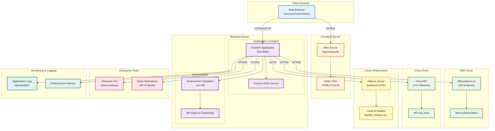

# Orchestra 8000 - Deployment Diagram

## Deployment Architecture

### Client Layer
- **Web Browser**: User interface accessed via modern web browsers
- **HTTPS Connection**: Secure communication with frontend and backend

### Frontend Deployment
- **Web Server**: Static file server (Nginx/Apache) hosting HTML/CSS/JS
- **Static Files**: Frontend application files served to clients
- **CDN (Optional)**: Content delivery network for global distribution

### Backend Deployment
- **FastAPI Application**: Python-based REST API server
- **Uvicorn ASGI Server**: High-performance async server running on port 8000
- **Environment Variables**: Secure configuration management via .env file
- **Container (Optional)**: Docker container for consistent deployment

### Cloud AI Services
- **IBM watsonx.ai**: Enterprise AI service with IAM authentication
- **Groq Cloud**: Ultra-fast LPU inference service with API key authentication
- **HTTPS Communication**: Secure API calls to cloud providers

### Local Infrastructure
- **Ollama Server**: Self-hosted AI model server on localhost:11434
- **Local Models**: Downloaded AI models (llama2, mistral, etc.)
- **HTTP Communication**: Local network communication

### Enterprise Integration
- **Jira Cloud**: Issue tracking and incident management system
- **Slack API**: Team communication and alerting platform
- **Webhook Support**: Real-time notifications and updates

### Monitoring & Operations
- **Application Logs**: stdout/stderr logging for debugging
- **Performance Metrics**: Request latency, error rates, throughput
- **Health Checks**: Endpoint monitoring and availability

## Deployment Options

### Option 1: Cloud Deployment
- Frontend: Vercel/Netlify/AWS S3 + CloudFront
- Backend: AWS EC2/ECS, Google Cloud Run, or Azure App Service
- Database: PostgreSQL on RDS/Cloud SQL (if needed)

### Option 2: On-Premises Deployment
- Frontend: Internal web server
- Backend: Internal application server
- Ollama: Local GPU server for AI inference
- Network: Internal corporate network with firewall rules

### Option 3: Hybrid Deployment
- Frontend: Cloud CDN for global access
- Backend: On-premises for data security
- AI Services: Mix of cloud (watsonx, Groq) and local (Ollama)

## Security Considerations
- API keys stored in environment variables, never in code
- HTTPS/TLS for all external communications
- CORS configuration for frontend access control
- Rate limiting on API endpoints
- Authentication/authorization for production deployments