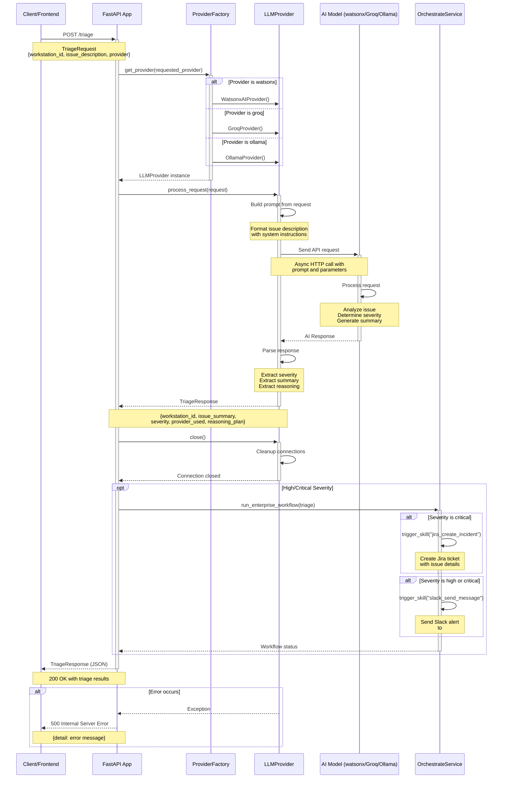

# Orchestra 8000 - Triage Request Flow Sequence Diagram

## Flow Description

### 1. Request Initiation
- Client sends POST request to `/triage` endpoint with workstation ID, issue description, and optional provider preference

### 2. Provider Selection
- Factory pattern determines which AI provider to use based on request or environment configuration
- Instantiates appropriate provider (WatsonxAI, Groq, or Ollama)

### 3. Request Processing
- Provider builds a formatted prompt from the issue description
- Sends async request to the AI model API
- AI model analyzes the issue and generates structured response

### 4. Response Parsing
- Provider extracts severity level, issue summary, and reasoning from AI response
- Constructs TriageResponse object with all relevant data

### 5. Connection Cleanup
- Provider closes any persistent connections or clients
- Ensures proper resource management

### 6. Enterprise Workflow (Conditional)
- For high/critical severity issues, triggers enterprise workflows
- Creates Jira tickets for critical issues
- Sends Slack notifications for high/critical issues

### 7. Response Return
- API returns structured TriageResponse to client
- Includes all triage details and metadata

### Error Handling
- Any exceptions during processing result in 500 error
- Error details are logged and returned to client