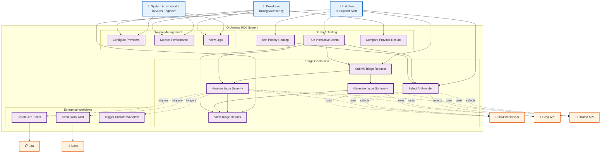

# Orchestra 8000 - Use Case Diagram

## Use Case Descriptions

### Triage Operations

#### UC1: Submit Triage Request
**Actor**: End User, IT Support Staff  
**Description**: User submits a workstation issue with description for AI-powered triage  
**Preconditions**: User has access to the system  
**Postconditions**: Triage request is processed and results are returned  
**Flow**:
1. User enters workstation ID
2. User describes the issue
3. User optionally selects preferred AI provider
4. System validates input
5. System routes to appropriate provider

#### UC2: Select AI Provider
**Actor**: End User, System  
**Description**: Choose which AI model to use for triage (watsonx, Groq, or Ollama)  
**Preconditions**: Multiple providers are configured  
**Postconditions**: Selected provider processes the request  
**Flow**:
1. User selects priority (Cost, Speed, Accuracy)
2. System determines optimal provider
3. System instantiates selected provider

#### UC3: Analyze Issue Severity
**Actor**: System, AI Provider  
**Description**: AI model analyzes issue and determines severity level  
**Preconditions**: Valid triage request received  
**Postconditions**: Severity level assigned (low, medium, high, critical)  
**Flow**:
1. System sends issue to AI provider
2. AI analyzes complexity and urgency
3. AI assigns severity level
4. System validates severity

#### UC4: Generate Issue Summary
**Actor**: System, AI Provider  
**Description**: AI model creates concise summary of the issue  
**Preconditions**: Issue description provided  
**Postconditions**: Clear, actionable summary generated  
**Flow**:
1. AI processes issue description
2. AI extracts key information
3. AI generates structured summary
4. System validates summary format

#### UC5: View Triage Results
**Actor**: End User  
**Description**: User views the complete triage analysis results  
**Preconditions**: Triage processing completed  
**Postconditions**: User understands issue severity and next steps  
**Flow**:
1. System displays severity level
2. System shows issue summary
3. System presents reasoning/plan
4. System indicates provider used

### Enterprise Workflows

#### UC6: Create Jira Ticket
**Actor**: System, Orchestrate Service  
**Description**: Automatically create Jira ticket for critical issues  
**Preconditions**: Issue severity is critical  
**Postconditions**: Jira ticket created with issue details  
**Trigger**: Critical severity detected

#### UC7: Send Slack Alert
**Actor**: System, Orchestrate Service  
**Description**: Send notification to Slack channel for high/critical issues  
**Preconditions**: Issue severity is high or critical  
**Postconditions**: Team notified via Slack  
**Trigger**: High or critical severity detected

#### UC8: Trigger Custom Workflow
**Actor**: System, Orchestrate Service  
**Description**: Execute custom enterprise workflows based on triage results  
**Preconditions**: Workflow rules configured  
**Postconditions**: Appropriate actions taken  
**Trigger**: Configurable conditions met

### System Management

#### UC9: Configure Providers
**Actor**: System Administrator, Developer  
**Description**: Configure AI provider settings and credentials  
**Preconditions**: Admin access granted  
**Postconditions**: Providers properly configured  

#### UC10: Monitor Performance
**Actor**: System Administrator, Developer  
**Description**: Monitor system performance, response times, and error rates  
**Preconditions**: Monitoring tools configured  
**Postconditions**: Performance metrics available  

#### UC11: View Logs
**Actor**: System Administrator, Developer  
**Description**: Access application logs for debugging and auditing  
**Preconditions**: Logging enabled  
**Postconditions**: Logs accessible for analysis  

### Demo & Testing

#### UC12: Run Interactive Demo
**Actor**: End User, Prospective Customer  
**Description**: Experience live triage demonstration on hero page  
**Preconditions**: Demo page loaded  
**Postconditions**: User understands system capabilities  

#### UC13: Test Priority Routing
**Actor**: End User, Developer  
**Description**: Test how different priorities affect provider selection  
**Preconditions**: Multiple providers available  
**Postconditions**: Routing logic validated  

#### UC14: Compare Provider Results
**Actor**: Developer  
**Description**: Compare results from different AI providers for same issue  
**Preconditions**: Multiple providers configured  
**Postconditions**: Provider performance compared  

## Actor Descriptions

### End User / IT Support Staff
- Submits triage requests for workstation issues
- Views triage results and recommendations
- Uses interactive demo to understand system
- Primary beneficiary of the system

### System Administrator / DevOps Engineer (Kimberley Bezuidenhout)
- Configures and maintains system infrastructure
- Monitors performance and availability
- Manages deployment and scaling
- Ensures security and compliance

### Developer (Katlego Tlhapiso, Kimberley Bezuidenhout)
- Develops and maintains application code
- Configures AI providers and integrations
- Tests and validates system functionality
- Analyzes logs and troubleshoots issues

### External Systems
- **IBM watsonx.ai**: Enterprise-grade AI for accuracy-focused tasks
- **Groq API**: Ultra-fast inference for speed-focused tasks
- **Ollama API**: Local AI for cost-focused and privacy-sensitive tasks
- **Jira**: Issue tracking and incident management
- **Slack**: Team communication and alerting